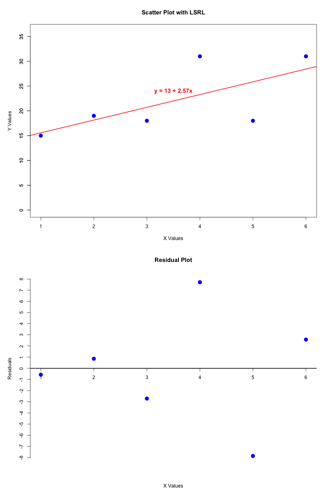
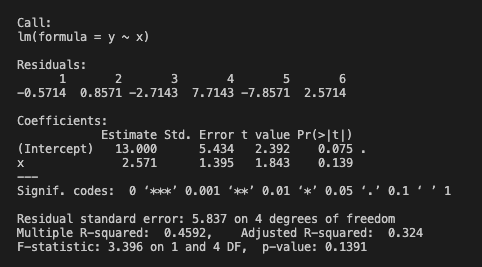
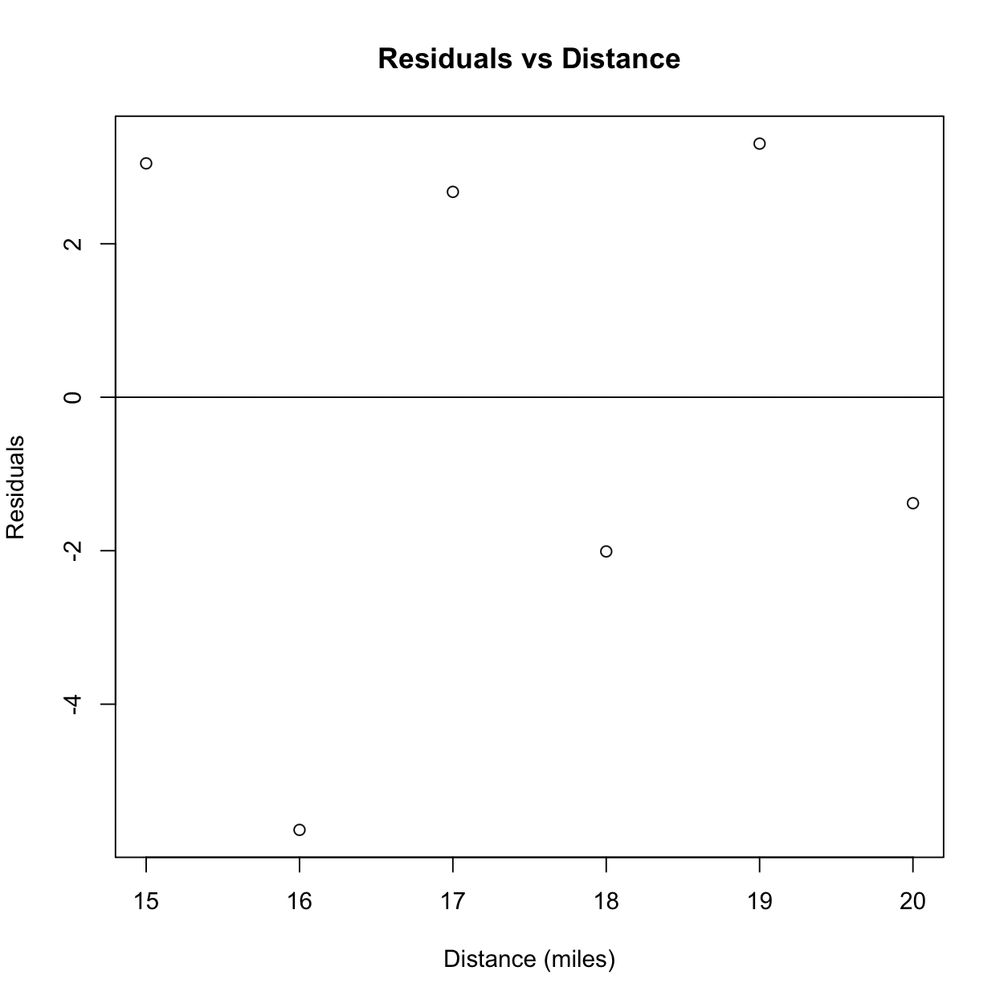

# Basic R programs for Statistics Class

## Overview
These programs are being written for a statistics class that I am currently taking at my university. The repository will be updated throughout the course as I work on different statistical concepts and analyses using R. Topics covered will include probability, descriptive statistics, hypothesis testing, regression, and more.

### Prerequisites
To run these programs, you need to have R installed on your system. You can download it from the official CRAN website:  
[https://cran.r-project.org/](https://cran.r-project.org/)

You can use either **Visual Studio Code (VS Code)** or **RStudio** to run these scripts:

- **VS Code** requires additional setup, including installing extensions and configuring the R language server (see below).
- **RStudio** is an alternative that comes with built-in support for running R scripts, visualizing plots, and managing projects, making it a convenient choice for many users.

# Setting Up R in VS Code

If you plan to use **Visual Studio Code (VS Code)** for running and editing R scripts, follow these steps:

1. **Install the R Extension** in VS Code.
2. **Open R and install the required language server package** by running:
   ```r
   install.packages("languageserver")
   ```
3. **Install the R Extension Pack** by Yuki Ueda from the VS Code marketplace.  
   (This extension pack provides additional tools to improve the R development experience.)
4. **Restart VS Code** to ensure all extensions are loaded correctly.

Once these steps are completed, you should be able to write and execute R scripts smoothly within VS Code.


# Repository Contents

<div align="center">
<h1><code>lsrl.R</code></h1>
</div>

### What is the Least Squares Regression Line (LSRL)?
The **Least Squares Regression Line (LSRL)** is the best-fitting straight line that minimizes the sum of squared residuals. It models the relationship between an independent variable (`x`) and a dependent variable (`y`) using a linear equation of the form:

- The **intercept** represents the predicted `y` value when `x = 0`.
- The **slope** represents how much `y` changes for each unit increase in `x`.

The `lslr.R` script performs a **simple linear regression** using a set of `x` and `y` values. It:

1. Defines two vectors (`x` and `y`) containing numeric data.
2. Creates a linear model (`lm(y ~ x)`) to predict `y` based on `x`.
3. Extracts **residuals** (differences between actual and predicted values).
4. Extracts **fitted values** (predicted `y` values from the model).
5. Plots the residuals against `x` in a **residual plot**, which helps visualize how well the model fits the data.

### Assumptions of Simple Linear Regression
For the regression model to be valid, these conditions should be met:

- **Linearity**: The relationship between `x` and `y` should be linear.
- **Independence**: Observations should be independent.
- **Homoscedasticity**: Residuals should have constant variance.
- **Normality of Residuals**: Residuals should be approximately normally distributed.

#### Regression Line and Residual Plot
Below is the plot generated by the `lsrl.R` script:



**Description of the Plot:**
- The **top plot** is a scatter plot of the data points with the **Least Squares Regression Line (LSRL)** fitted in red.
- The equation of the LSRL is **y = 13 + 2.57x**, which means:
  - The intercept is **13**, representing the predicted `y` value when `x = 0`.
  - The slope is **2.57**, indicating that for each unit increase in `x`, `y` increases by **2.57** units on average.
- The **bottom plot** is the **residual plot**, which displays the residuals (differences between actual and predicted `y` values).
  - Residuals above the horizontal line indicate points where the model underestimates `y`.
  - Residuals below the line indicate points where the model overestimates `y`.
  - The spread and pattern of residuals help assess whether the linear model is appropriate for the data.


#### Regression Summary
Below is the regression summary output from the `lsrl.R` script:



**Summary of the Regression Analysis:**
- The regression equation is **y = 13 + 2.57x**, where:
  - **Intercept (13)**: This represents the expected `y` value when `x = 0`. It serves as the baseline prediction.
  - **Slope (2.57)**: This means that for every one-unit increase in `x`, the predicted `y` increases by **2.57** units.
- **Multiple R-squared: 0.4592**:
  - This value represents the **coefficient of determination**, which measures how well the model explains the variability in `y`.
  - An **R² of 0.4592** means that **45.92%** of the variance in `y` is explained by `x`, indicating a moderate linear relationship.
- **Adjusted R-squared: 0.324**:
  - This adjusts for the number of predictors in the model and provides a more accurate measure of goodness-of-fit.
  - Since it's lower than the multiple R², it suggests that additional predictors may improve the model.
- **P-value for x (0.139)**:
  - This suggests that the relationship between `x` and `y` is not statistically significant at the common 0.05 significance level.

Overall, while the model suggests a positive relationship between `x` and `y`, the R² value indicates that other factors may also influence `y`, and the model does not explain all of the variability.

---

<div align="center">
<h1><code>computePDFproperties.R</code></h1>
</div>

### What is the Probability Density Function (PDF)?  
A **Probability Density Function (PDF)** represents the probability distribution of a continuous random variable. It describes the likelihood of a variable taking on different values within a specified range. The area under the PDF over an interval corresponds to the probability that the variable falls within that interval.

The `computePDFproperties.R` script defines and analyzes a **custom probability density function (PDF)** given by:

- **f(x) = kx(1 - x)** for `x` in `[0,1]`
- The **constant `k`** is determined to ensure the function is properly normalized so that the total probability equals **1**.

The script then performs various computations related to this probability distribution.

### What Does `computePDFproperties.R` Do?  
The script analyzes the given PDF by performing the following tasks:

1. **Computes the Normalization Constant (`k`)**  
   - Solves for `k` so that **∫₀¹ f(x) dx = 1**.

2. **Calculates Probability Values**  
   - **P(0.4 < X < 1)**: Probability that `X` falls between `0.4` and `1`.  
   - **P(X ≤ 0.4)**: Probability that `X` is less than or equal to `0.4`.  
   - **P(X < 0.8)**: Probability that `X` is less than `0.8`.  
   - **Conditional Probability P(X < 0.4 | X < 0.8)**: Computed using **P(A | B) = P(A ∩ B) / P(B)**.

3. **Computes Statistical Properties**  
   - **Expected Value (`E[X]`)**: The mean of `X`.  
   - **Expected Value (`E[X²]`)**: A key component for variance calculation.  
   - **Variance (`Var(X)`)**: Measures how much `X` deviates from its mean, calculated using **Var(X) = E[X²] - (E[X])²**.

4. **Computes and Plots the Cumulative Distribution Function (CDF)**  
   - The **CDF** is obtained by integrating the **PDF** from `0` to `x`.  
   - A **CDF plot** is generated to visualize how probability accumulates across the interval `[0,1]`.

### Assumptions of the Probability Model  
For the probability distribution to be valid, the following conditions must be met:

- **Non-Negativity**: `f(x) ≥ 0` for all `x` in `[0,1]`.  
- **Normalization**: The total area under the **PDF** curve must equal **1**.

#### Cumulative Distribution Function  
Below is the plot generated by the `computePDFproperties.R` script:


**Description of the Plot:**
- The plot represents the **Cumulative Distribution Function (CDF)** of the probability density function \( f(x) = kx(1 - x) \), where \( k = 6 \).
- The CDF is obtained by integrating the probability density function (PDF) from **0 to x**.
- The **x-axis** represents values of the random variable \( X \) in the range **[0,1]**.
- The **y-axis** represents \( F(x) \), the probability that \( X \) takes on a value **less than or equal to x**.
- The shape of the curve follows an **S-like pattern**, indicating that:
  - The probability is low for small \( x \) values.
  - The probability increases more rapidly for mid-range values.
  - The probability approaches **1** as $x \to 1$, ensuring a valid cumulative distribution.
- This plot helps visualize how probability accumulates over the range of \( X \), making it easier to interpret probability calculations like \( P(a < X < b) \).

---

<div align="center">
<h1><code>distanceVsTime.R</code></h1>
</div>

### What is the Commute Distance vs Time Analysis?
The `distancevstime.R` script performs a **simple linear regression** on a small commute dataset:

- **Data**: Defines `x` (distance in miles) and `y` (time in minutes).
- **Scatterplot**: Visualizes how commute time varies with distance.
- **Model Fitting**: Uses `lm(y ~ x)` to estimate intercept and slope, then prints the coefficient of determination (**R²**).
- **Residual Plot**: Plots the residuals (actual – predicted times) against distance with a horizontal zero line to check for randomness and constant variance.

### Plots

  


**Description of the Plots:**
- **Commute Distance vs Time**: Each point represents one drive. The overall trend shows whether longer distances typically take more time.
- **Residuals vs Distance**: Displays deviations from the fitted line. A random scatter around zero suggests that the linear model is appropriate.

### Output

When you run the script, you’ll see:

```
[1] 0.433
Fail to reject H0: slope = 0 (p = 0.155)
```

**Summary of the Output:**
- The first line is the **R² value**, printed by `print(r2)`.
- The second line reports the hypothesis test result at α = 0.05.  
  Since **p ≈ 0.155 > 0.05**, we **fail to reject H₀** (the slope is not significantly different from zero).
- If you change the `x` or `y` values, both **R²** and the **p-value** will change, which may alter whether you reject H₀.